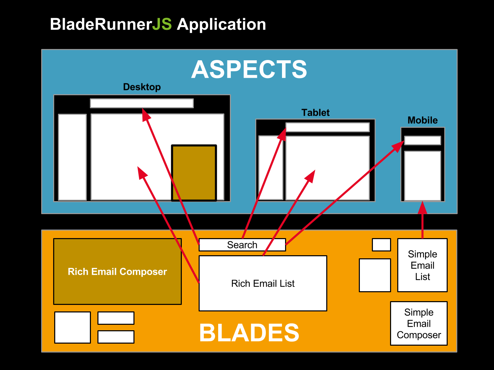

# Apps & Aspects

**TODO: Review and update**

We're building ModularApp and you'll noticed that within the `modularapp` directory
there's a `default-aspect` directory. This is the default entry point for the
application. Aspects are a view of an application, composed of Blades.

So, the next thing we need to do is bring the Blades that we've created into the
Aspect.
