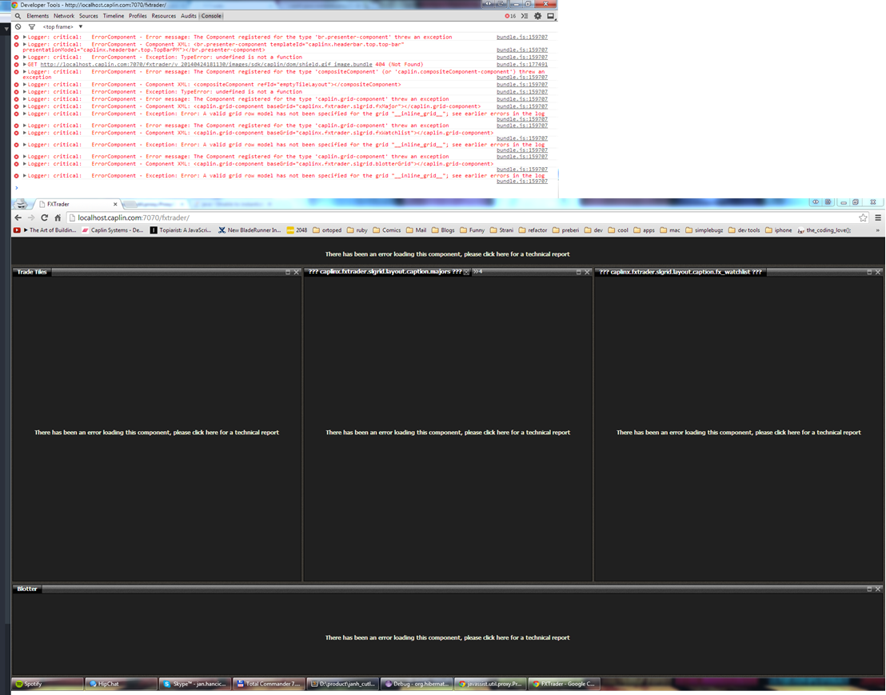
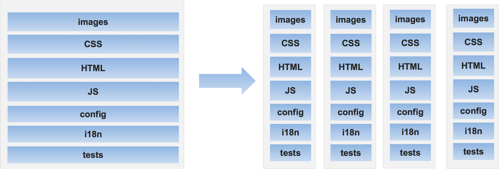
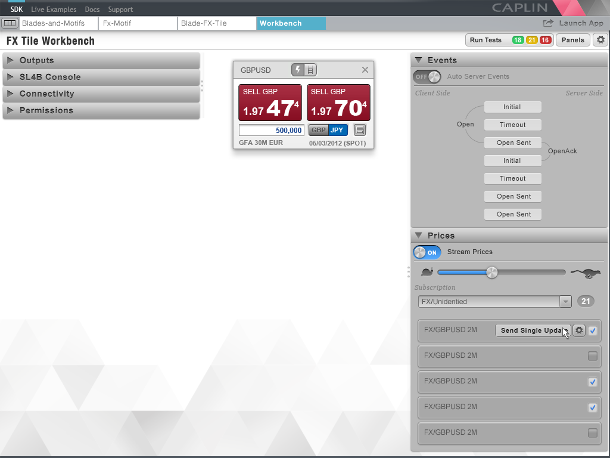

# Who Broke the App?

## Group Code By Feature (same as other Assets)

Reduce chances of merge conflicts or complete incompatibility.

## Run Feature in Isolation

Broken code in locations unrelated to the feature you're working on won't stop you developing.
