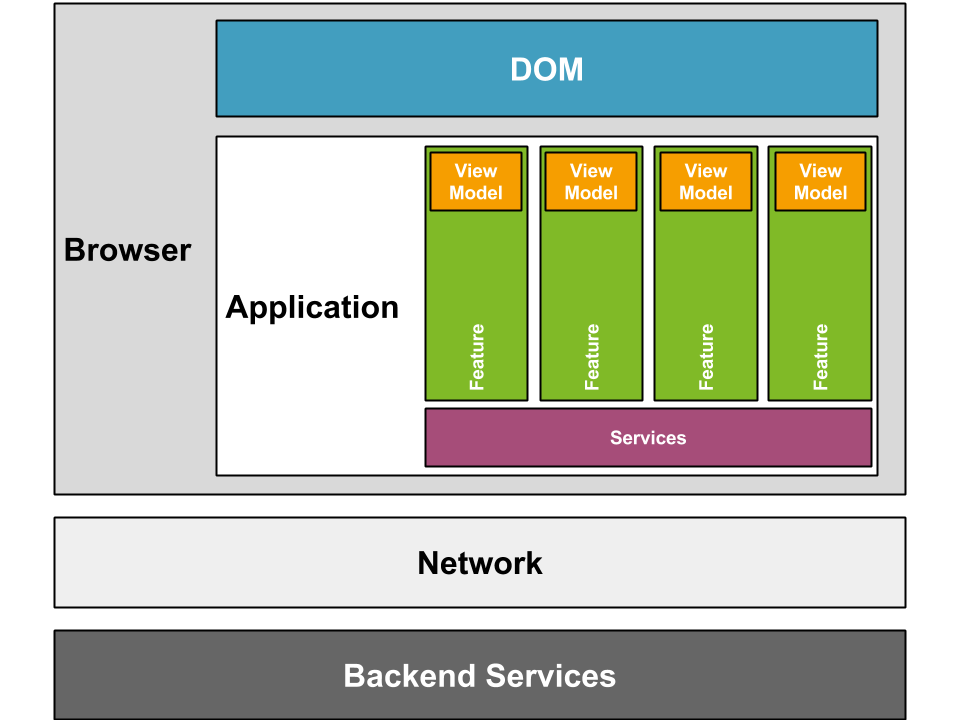

# Full Feature Testing

From the earlier exercises you'll remember that we used an MVVM solution for our UI. In combination with services this means we can actually test our full feature in isolation.

We can:

1. Interact with the View Model and make assertions against the interactions that took place with Services
2. Inject a test double/fake service into the ServiceRegistry, get it to behave in a certain way to test a feature requirement, and then assert the state of the View Model

## Next: An overview of the ModularApp Services
